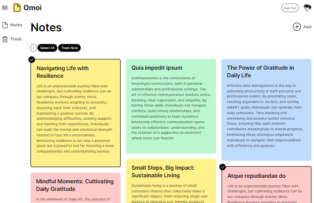

# Omoi 📝

**Omoi** (思い出す — "to remember" in Japanese) is a simple, open-source note-taking app built with Next.js.



## Features

- **Clean interface** — distraction-free note-taking with modal create/edit
- **Google sign-in** — private notes per user via NextAuth.js
- **Full CRUD** — create, read, update, delete notes
- **Color coding** — yellow, red, blue, and green note colors
- **Trash** — soft-delete, restore, and permanent delete
- **Bulk actions** — multi-select and move notes to trash
- **Responsive** — works on desktop and mobile

## Tech Stack

| Layer | Technology |
|---|---|
| Framework | [Next.js 15](https://nextjs.org/) (App Router) |
| UI | [React 19](https://react.dev/) |
| Styling | [Tailwind CSS 3](https://tailwindcss.com/) |
| Database | [MongoDB](https://www.mongodb.com/) + [Mongoose 7](https://mongoosejs.com/) |
| Auth | [NextAuth.js 4](https://next-auth.js.org/) (Google OAuth) |
| Testing | [Vitest 3](https://vitest.dev/) |
| Linting | ESLint + `eslint-config-next` |
| Hosting | [Vercel](https://vercel.com/) (automatic Git deployments) |

## Getting Started

### Prerequisites

- Node.js 18+ (20 recommended)
- MongoDB (local install or [MongoDB Atlas](https://www.mongodb.com/atlas))
- [Google OAuth credentials](https://console.cloud.google.com/) (OAuth 2.0 Client ID)
- npm

### Installation

1. Clone the repository:

```bash
git clone https://github.com/c-ent/Omoi.git
cd Omoi
```

2. Install dependencies:

```bash
npm install
```

3. Set up environment variables:

```bash
cp .env.example .env
```

Edit `.env` (or `.env.local` for local dev) with your values:

```env
MONGODB_URI=mongodb://localhost:27017/omoi
NEXTAUTH_URL=http://localhost:3000
NEXTAUTH_SECRET=your-long-random-secret
GOOGLE_ID=your-google-oauth-client-id
GOOGLE_CLIENT_SECRET=your-google-oauth-client-secret
```

4. Start the development server:

```bash
npm run dev
```

5. Open [http://localhost:3000](http://localhost:3000)

## Available Scripts

| Command | Description |
|---|---|
| `npm run dev` | Start development server |
| `npm run build` | Production build |
| `npm run start` | Start production server (after build) |
| `npm run lint` | Run ESLint |
| `npm test` | Run unit tests once |
| `npm run test:watch` | Run unit tests in watch mode |

## Testing

Tests use **Vitest** and live next to the code they cover.

### Run tests

```bash
npm test
```

Watch mode during development:

```bash
npm run test:watch
```

### What is tested

| Test file | What it covers |
|---|---|
| `lib/__tests__/note-validation.test.js` | Note field validation, color keys, MongoDB ObjectId checks, `sanitizeBgColor` |
| `lib/__tests__/api-errors.test.js` | Standard JSON error responses (`jsonError`) |
| `lib/__tests__/notes.test.js` | Note ownership checks (`isNoteOwner`) |
| `hooks/__tests__/multi-select-utils.test.js` | Bulk selection helpers (toggle, select-all, prune) |

**23 unit tests** across validation, API errors, ownership, and selection logic.

### CI

GitHub Actions (`.github/workflows/ci.yml`) runs lint, tests, and a production build on every push and pull request to `main` / `master`.

## Deployment (Vercel)

This project is connected to [Vercel](https://vercel.com/) via GitHub. Pushes to `main` / `master` trigger a production deploy; pull requests get preview URLs.

### Environment variables

If the repo is already on Vercel, confirm these are set under **Project → Settings → Environment Variables** (Production and Preview):

| Variable | Description |
|---|---|
| `MONGODB_URI` | MongoDB Atlas connection string |
| `NEXTAUTH_URL` | Your Vercel URL (e.g. `https://omoi.vercel.app`) |
| `NEXTAUTH_SECRET` | Random secret for session encryption |
| `GOOGLE_ID` | Google OAuth client ID |
| `GOOGLE_CLIENT_SECRET` | Google OAuth client secret |

For local dev, copy [`.env.example`](.env.example) to `.env` and use `NEXTAUTH_URL=http://localhost:3000`.

**Google OAuth:** in [Google Cloud Console](https://console.cloud.google.com/), add your Vercel URL to **Authorized JavaScript origins** and `https://your-app.vercel.app/api/auth/callback/google` to **Authorized redirect URIs**.

**New to Vercel?** Import the repo at [vercel.com/new](https://vercel.com/new), then add the variables above.

### Deployment Protection

Vercel can hold a production deploy until GitHub CI passes, so a broken build does not reach your live URL even if Vercel’s own build succeeds.

1. Open your project in the [Vercel dashboard](https://vercel.com/dashboard).
2. Go to **Settings → Deployment Checks**.
3. Click **Add Checks** → choose **GitHub**.
4. Select the **`ci`** job from the **CI** workflow (`.github/workflows/ci.yml`).
5. Enable **Required** for that check.

After this, production deployments are created but not promoted to your domain until lint, tests, and build all pass in GitHub Actions.

### How deploys work

| Event | What happens |
|---|---|
| Push to `main` / `master` | Production deploy on Vercel (held until CI passes if Deployment Checks are enabled) |
| Open a pull request | Preview deploy with a unique URL |
| Every push / PR | GitHub Actions runs lint, tests, and build |

## Project Structure

```
omoi/
├── app/                        # Next.js App Router
│   ├── api/
│   │   ├── auth/[...nextauth]/ # NextAuth handler
│   │   └── note/               # Note CRUD API routes
│   ├── notes/                  # Notes list and trash pages
│   ├── layout.jsx              # Root layout
│   └── page.jsx                # Landing page
├── components/
│   ├── auth/                   # Sign-in prompts
│   ├── layout/                 # Nav, sidebar, app shell
│   ├── marketing/              # Landing page slider
│   ├── notes/                  # Note cards, forms, modals
│   ├── providers/              # Session provider
│   └── ui/                     # Modal, error banner, loading
├── hooks/                      # useMultiSelect + helpers
├── lib/                        # db, auth, notes, validation, API errors
├── models/                     # Mongoose User and Note schemas
├── styles/                     # Global CSS (Tailwind + semantic classes)
├── public/assets/              # Icons and images
└── vitest.config.mjs           # Test configuration
```

## How It Works

**Routes**

| Route | Description |
|---|---|
| `/` | Landing page |
| `/notes` | Notes list (create/edit via modals) |
| `/notes/trash` | Deleted notes (restore or permanently delete) |

**Note management**

- Create and edit notes in modals (title, body, color)
- Move notes to trash (soft delete)
- Restore or permanently delete from trash
- Bulk-select and trash multiple notes at once

**Color options:** yellow (default), red, blue, green

**Authentication:** Google OAuth via NextAuth — each user only sees their own notes

## Contributing

Contributions are welcome.

1. Fork the repository
2. Create a feature branch (`git checkout -b feature/my-feature`)
3. Run `npm run lint` and `npm test`
4. Commit your changes
5. Push and open a Pull Request

## License

This project is open source and available under the MIT License — see the `LICENSE` file for details.
